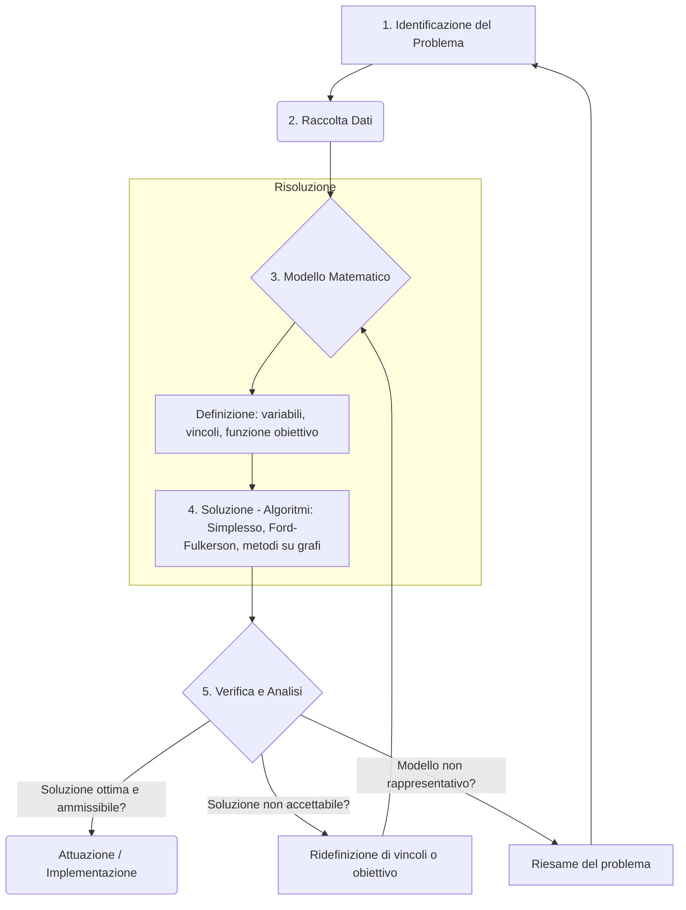

# Introduzione alla Ricerca Operativa

<h2> Il metodo delle 5 fasi </h2>

>### Attributi di una buona decisione
>- **efficace**: raggiunge lo scopo;
>- **efficiente**: raggiunge lo scopo consumando poche risorse;
>- **tempestiva**: coerente con l’orizzonte temporale del livello decisionale (strategico, tattico, operativo);
>- **robusta**: rimane buona (per lo meno ammissibile) anche in seguito a piccole variazioni nel valore dei dati;
>- **giustificabile**: può essere dimostrata razionale ad altri.
>

## Modello Matematico
$$
\begin{matrix}
\text{Funzione Obiettivo} & \min c^Tx
\\\
\text{Vincoli} & Ax \leq b
\\\
\end{matrix}
\quad \quad
\begin{matrix}
\text{Parametri} & b \in \mathbb{R}^m\\
& A \in \mathbb{R}^{m \times n}\\
& c \in \mathbb{R}^n
\\\
\\\
\text{Variabili} & x \in \mathbb{R}^n
\end{matrix}
$$

