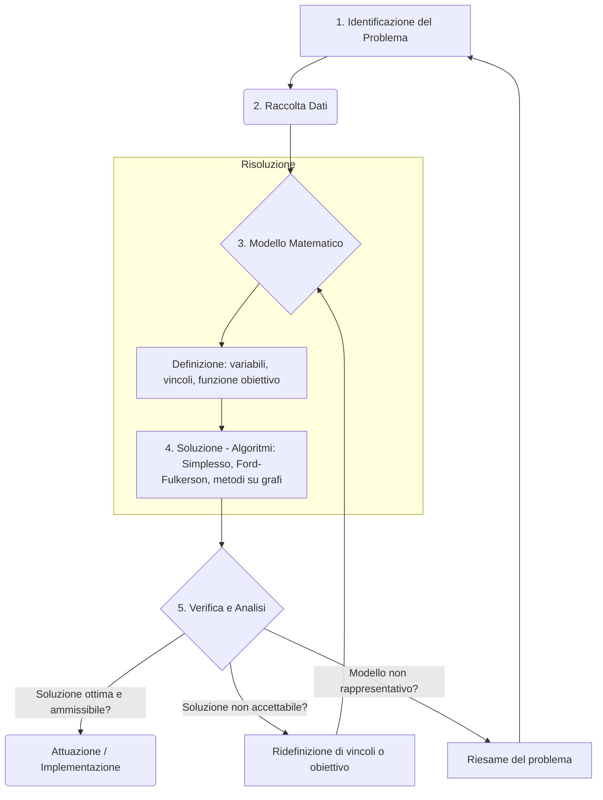

# Introduzione alla Ricerca Operativa

## Il metodo delle 5 fasi

```mermaid
graph TD
    A[1. Identificazione del Problema] --> B(2. Raccolta Dati)
    B --> C{3. Modello Matematico}
    
    subgraph D[Risoluzione]
        C --> E[Definizione: variabili, vincoli, funzione obiettivo]
        E --> F[4. Soluzione - Algoritmi: Simplesso, Ford-Fulkerson, metodi su grafi]
    end
    
    F --> G{5. Verifica e Analisi}
    
    G -- Soluzione ottima e ammissibile? --> H(Attuazione / Implementazione)
    
    G -- Soluzione non accettabile? --> I[Ridefinizione di vincoli o obiettivo]
    I --> C
    
    G -- Modello non rappresentativo? --> J[Riesame del problema]
    J --> A

```

