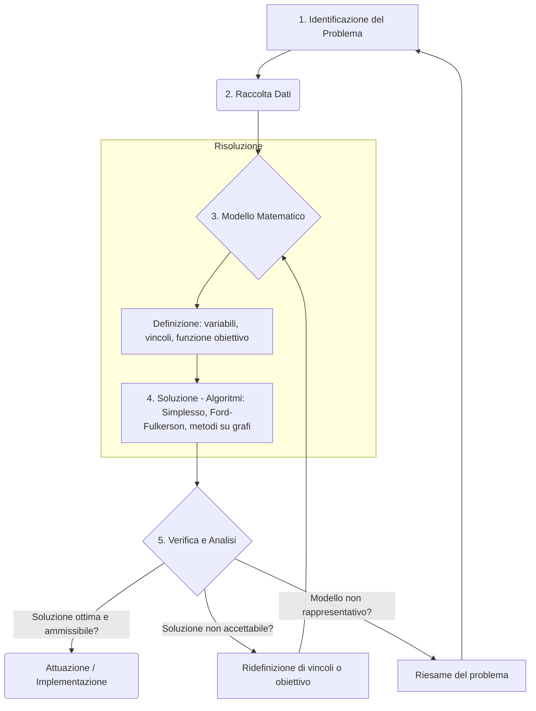

# Introduzione alla Ricerca Operativa

>### Attributi di una buona decisione
>- **efficace**: raggiunge lo scopo;
>- **efficiente**: raggiunge lo scopo consumando poche risorse;
>- **tempestiva**: coerente con l’orizzonte temporale del livello decisionale (strategico, tattico, operativo);
>- **robusta**: rimane buona (per lo meno ammissibile) anche in seguito a piccole variazioni nel valore dei dati;
>- **giustificabile**: può essere dimostrata razionale ad altri.
>

### Modello Matematico
$$
\begin{matrix}
\text{Funzione Obiettivo} & \min c^Tx
\\\
\text{Vincoli} & Ax \leq b
\\\
\end{matrix}
\quad \quad
\begin{matrix}
\text{Parametri} & b \in \mathbb{R}^m\\
& A \in \mathbb{R}^{m \times n}\\
& c \in \mathbb{R}^n
\\\
\\\
\text{Variabili} & x \in \mathbb{R}^n
\end{matrix}
$$

> [!Note]
>## Metodo Grafico - Ottimizzazione
>
>1. Cerco tutti i punti del piano ammissibili (Che soddisfano tutte le diseguazioni)
>    - Prendo un vincoli, e li pongo la diseguazioni in una uguaglianza
>    - Prendo 2 punti e traccio la retta
>    - Capire se ci interessa il sopra o quale lato del semipiano ci interessa
>        - Per esempio basta prendere un punto qualsiasi non della retta e capire se soddisfa la diseguazione
>2. Ripeto per tutti vincoli
>    - Fino a ottenere il poliedro delle soluzioni ammissibili
>3. Trovare l'ottimo in uno dei spigoli/angoli
>4. Il punto è ottenibile tramite intersezione fra 2 rette
>    - Metto a sistema le 2 rette (Con uguaglianza)
>    - Semplice sistema a 2 equazioni e 2 incognite (Risolvibile facilmente mettendolo in colonna)

>[!CAUTION]
>Se il poliedro è illimitato, bisogna fare attenzione se rispondere che il problema è inrisolubile poichè illimitato superiormente o inferiormente.

## Il metodo delle 5 fasi

<h3> Flowchart </h3>

